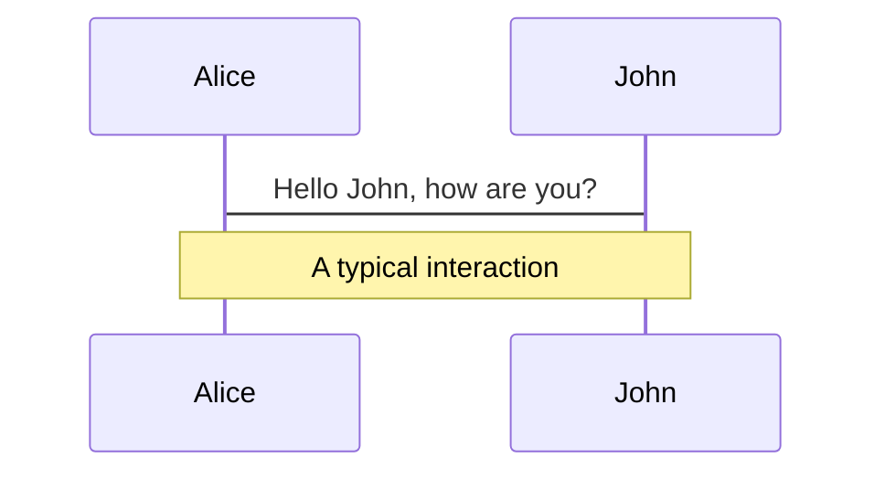
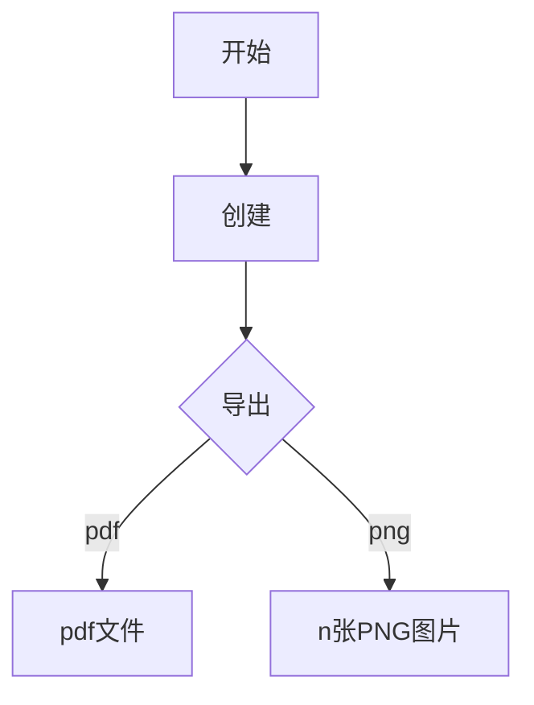

---
# try also 'default' to start simple
theme: seriph
# random image from a curated Unsplash collection by Anthony
# like them? see https://unsplash.com/collections/94734566/slidev
background: https://source.unsplash.com/collection/94734566/1920x1080
# apply any windi css classes to the current slide
class: 'text-center'
# https://sli.dev/custom/highlighters.html
highlighter: shiki
# show line numbers in code blocks
lineNumbers: false
# some information about the slides, markdown enabled
info: |
  ## Slidev Starter Template
  Presentation slides for developers.

  Learn more at [Sli.dev](https://sli.dev)
# persist drawings in exports and build
drawings:
  persist: false
---

# This is  Slidev

让PP制作和写代码一样丝滑

<div class="pt-12">
  <span @click="$slidev.nav.next" class="px-2 py-1 rounded cursor-pointer" hover="bg-white bg-opacity-10">
    开始 <carbon:arrow-right class="inline"/>
  </span>
</div>

<div class="abs-br m-6 flex gap-2">
  <button @click="$slidev.nav.openInEditor()" title="Open in Editor" class="text-xl icon-btn opacity-50 !border-none !hover:text-white">
    <carbon:edit />
  </button>
  <a href="https://github.com/slidevjs/slidev" target="_blank" alt="GitHub"
    class="text-xl icon-btn opacity-50 !border-none !hover:text-white">
    <carbon-logo-github />
  </a>
</div>


---

# 开始第一张

你可以通过将分隔符转换为 扉页块 (front matter)，为每张幻灯片指定布局 (layout) 和其他数据。每页信息都以分隔符 开始，以另一个分隔符 结束。两个分隔符之间的文本是 YAML 格式的数据对象。
```
--- // 分隔符
layout: center
background: 'https://source.unsplash.com/collection/94734566/1920x1080'

#这是一级标题
--- //分隔符
```

<br>
<br>

<span style="color: pink">了解更多 [Why Slidev?](https://sli.dev/guide/why)</span>


<style>
h1 {
  background-color: #2B90B6;
  background-image: linear-gradient(45deg, #4EC5D4 80%, #146b8c 20%);
  background-size: 100%;
  -webkit-background-clip: text;
  -moz-background-clip: text;
  -webkit-text-fill-color: transparent; 
  -moz-text-fill-color: transparent;
  /* color: #ff8640 !important; */
}
</style>

---

# 列表展示

使用 <kbd>| --- | --- |</kbd> 来创建列表， <span style="color: grree">[了解更多](https://sli.dev/guide/navigation.html)</span>

### 快捷键

|     |     |
| --- | --- |
| <kbd>right</kbd> / <kbd>space</kbd>| 下一步 |
| <kbd>left</kbd>  / <kbd>shift</kbd><kbd>space</kbd> | 上一步 |
| <kbd>up</kbd> | 上一页 |
| <kbd>down</kbd> | 下一页 |


<p v-after class="absolute bottom-23 left-45 opacity-30 transform -rotate-10">左下角!</p>


---
layout: image-right
image: https://source.unsplash.com/collection/94734566/1920x1080
---

# 代码展示

高亮展示

```ts {all|2|1-6|9|all}
interface User {
  id: number
  firstName: string
  lastName: string
  role: string
}

function updateUser(id: number, update: User) {
  const user = getUser(id)
  const newUser = {...user, ...update}  
  saveUser(id, newUser)
}
```

<arrow v-click="3" x1="400" y1="420" x2="230" y2="330" color="#564" width="3" arrowSize="1" />

[^1]: [了解更多用法](https://sli.dev/guide/syntax.html#line-highlighting)

<style>
.footnotes-sep {
  @apply mt-20 opacity-10;
}
.footnotes {
  @apply text-sm opacity-75;
}
.footnote-backref {
  display: none;
}
</style>

---

# 代码编辑
>在PPT里写代码

```ts {monaco}
interface User {
  id: number
  firstName: string
  lastName: string
  role: string
}

function updateUser(id: number, update: User) {
  const user = getUser(id)
  const newUser = {...user, ...update}  
  saveUser(id, newUser)
}
```

---

# 组件

Slidev提供了一些集成的组件，如果想要自定义新组件，可以在components文件夹下面新增。

<div grid="~ cols-2 gap-6">
<div>

```html
<Counter :count="10" />
```


<Counter :count="10" m="t-4" />

<div class="relative top-10">

```html
<Link to="1">跳转第一页</Link>
```

<Link to="1" >跳转第一页</Link>

</div>

</div>

<div>

```html
<Tweet id="1390115482657726468" />
```

<Tweet id="1390115482657726468" scale="0.65" />

</div>


</div>


---
class: px-10
---

# 主题选择


<div grid="~ cols-2 gap-2" m="-t-2">

```yaml
---
theme: default
---
```

```yaml
---
theme: seriph
---
```


</div>

[主题库](https://sli.dev/themes/gallery.html).

---
---

# 点击动画

- v-click指令 或 <kbd>v-click</kbd>标签： 为元素添加点击动画
- v-after: 在上一个v-click触发后使所在元素可见
- v-click-hide: 点击后所在元素消失
<br>
```js
<div v-click>Hello</div>
<div v-after class="relative top-10">World</div>
<div v-click-hide class="relative top-20">点下一步后消失</div>
```

<div class="relative top-10">
<div v-click class="top-10">Hello</div>
<div v-after class="relative top-10">World</div>
<div v-click-hide class="relative top-20">点击后消失</div>
</div>


---
<!-- clicks: 3
--- -->

# 群组动画
```ts
<v-clicks>

- Item 1
- Item 2
- Item 3
- Item 4

</v-clicks>
```

<v-clicks>

<div> Item 1</div>
<div> Item 2</div>
<div> Item 3</div>
<div> Item 4</div>

</v-clicks>


---

# 点击动画的过渡样式

点击出现和隐藏时，元素上都会被加上默认的类名来应用对应的过度

<br>
<br>

```ts
// the default

.slidev-vclick-target {
  transition: opacity 100ms ease;
}

.slidev-vclick-hidden {
  opacity: 0;
  pointer-events: none;
}
```

---
preload: false
---

# 动画 


```html
<div
  v-motion
  :initial="{ x: -80 }"
  :enter="{ x: 0 }">
  Slidev
</div>
```

<div class="w-60 relative mt-6">
  <div class="relative w-40 h-40">
    
    
    
  </div>

  <div 
    class="text-5xl absolute top-14 left-40 text-[#2B90B6] -z-1"
    v-motion
    :initial="{ x: -80, opacity: 0}"
    :enter="{ x: 0, opacity: 1, transition: { delay: 2000, duration: 1000 } }">
    Slidev
  </div>
</div>

<!-- vue script setup scripts can be directly used in markdown, and will only affects current page -->
<script setup lang="ts">
const final = {
  x: 0,
  y: 0,
  rotate: 0,
  scale: 1,
  transition: {
    type: 'spring',
    damping: 10,
    stiffness: 20,
    mass: 2
  }
}
</script>

<div
  v-motion
  :initial="{ x:35, y: 40, opacity: 0}"
  :enter="{ y: 0, opacity: 1, transition: { delay: 3500 } }">

[Learn More](https://sli.dev/guide/animations.html#motion)

</div>


---

# 图表

用markdown画图表📈

<div class="grid grid-cols-2 gap-10 pt-4 -mb-6">





</div>

[Learn More](https://sli.dev/guide/syntax.html#diagrams)


---
layout: two-cols
---

# 导出为PDF
>使用此功能前需要安装 playwright-chromium

<br>
<br>

```ts
npm i -D playwright-chromium
slidev export
slidev export --dark // 导出暗色主题文件
```
运行以上命令后，在`./slide-export.pdf`中可以看到导出的PDF文件

::right::
# 导出为图片
>使用此功能前需要安装 playwright-chromium，将每页PPT导出为一张PNG图片

<br>
<br>

```ts
slidev export --format png
```
<style>
.col-left{
  margin-right: 20px;
}
</style>

---
layout: center
class: text-center
---

# StackBlitz
与VSCode近似的在线IDE


[🔗](https://stackblitz.com/)
